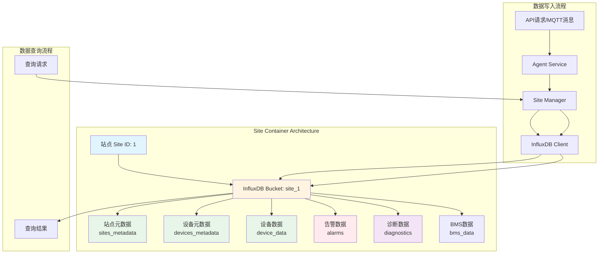
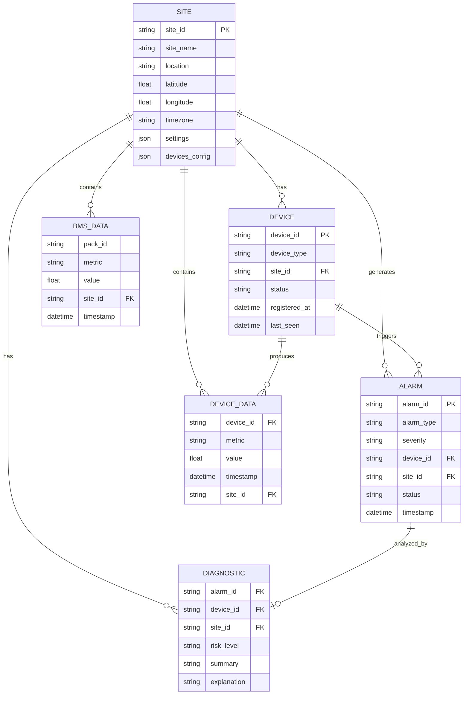
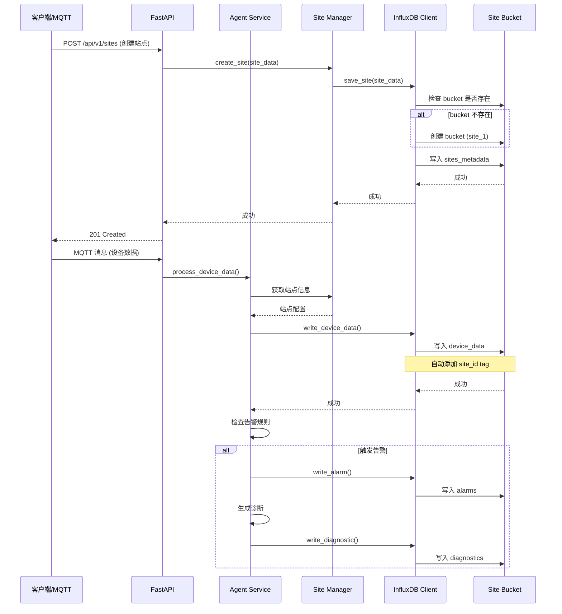
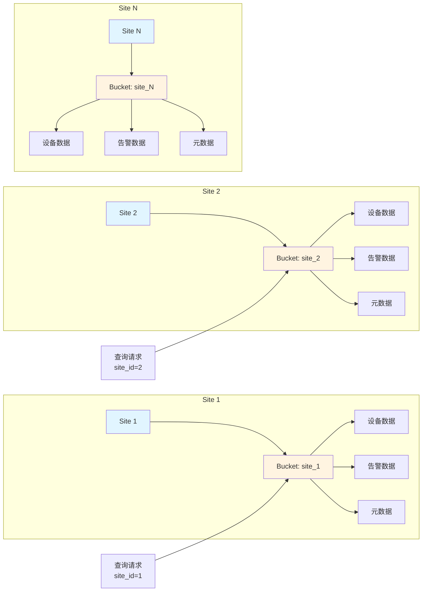
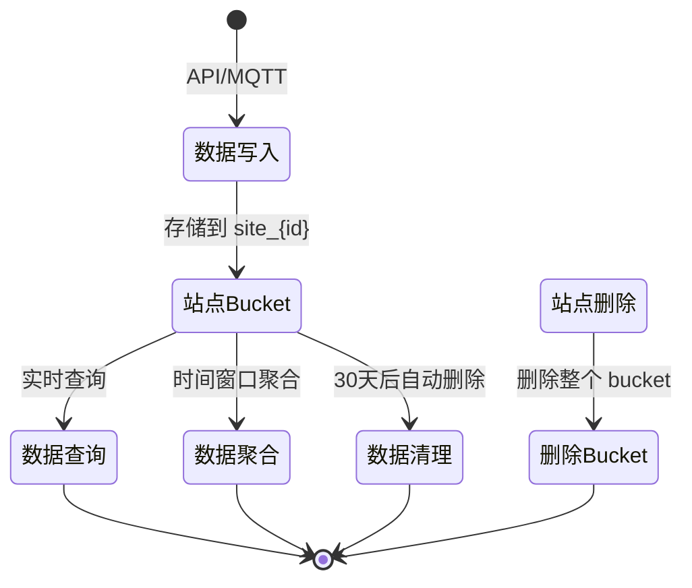

# Site Data Flow Diagram

## 站点数据存储架构流程图



## 站点数据结构关系图



## 数据写入详细流程



## 数据查询流程

```mermaid
flowchart TD
    Start[查询请求] --> Check{查询类型}
    
    Check -->|站点列表| QuerySites[查询所有站点]
    Check -->|站点详情| QuerySite[查询单个站点]
    Check -->|设备数据| QueryDevices[查询设备数据]
    Check -->|告警数据| QueryAlarms[查询告警]
    Check -->|时间序列| QueryTimeSeries[查询时间序列]
    
    QuerySites --> ListBuckets[列出所有 site_* buckets]
    ListBuckets --> GetMetadata[获取 sites_metadata]
    GetMetadata --> ReturnSites[返回站点列表]
    
    QuerySite --> GetBucket[获取 site_{id} bucket]
    GetBucket --> GetSiteMeta[查询 sites_metadata]
    GetSiteMeta --> ReturnSite[返回站点信息]
    
    QueryDevices --> GetDeviceBucket[获取站点 bucket]
    GetDeviceBucket --> FilterDevice[过滤 device_data]
    FilterDevice --> Aggregate[聚合数据]
    Aggregate --> ReturnDevices[返回设备数据]
    
    QueryAlarms --> GetAlarmBucket[获取站点 bucket]
    GetAlarmBucket --> FilterAlarm[过滤 alarms]
    FilterAlarm --> SortAlarm[排序和分页]
    SortAlarm --> ReturnAlarms[返回告警列表]
    
    QueryTimeSeries --> GetTSBucket[获取站点 bucket]
    GetTSBucket --> FilterTS[过滤 device_data]
    FilterTS --> Window[时间窗口聚合]
    Window --> NumericFilter[过滤数值字段]
    NumericFilter --> MeanAgg[mean 聚合]
    MeanAgg --> ReturnTS[返回时间序列]
    
    ReturnSites --> End[返回结果]
    ReturnSite --> End
    ReturnDevices --> End
    ReturnAlarms --> End
    ReturnTS --> End
```

## 站点数据隔离机制



## 数据生命周期



